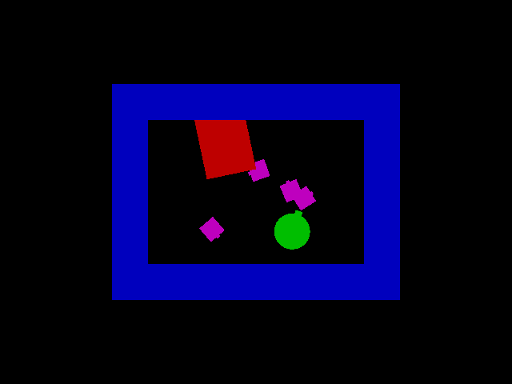
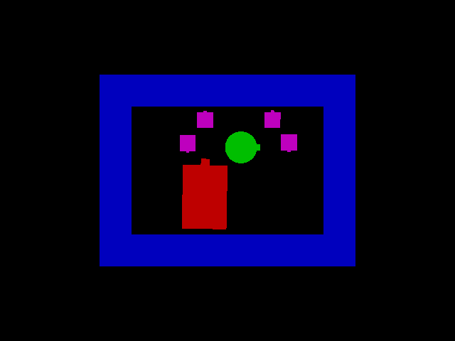

# simugeom - program package for geometry simulation 

 

Reference: A. Handa, V. Pătrăucean, S. Stent and R. Cipolla, "SceneNet: An annotated model generator for indoor scene understanding," 2016 IEEE International Conference on Robotics and Automation (ICRA), Stockholm, Sweden, 2016, pp. 5737-5743, doi: 10.1109/ICRA.2016.7487797.

    simugeom - program package for geometry simulation 
    Copyright (C) 2019, 2023 Sk. Mohammadul Haque

    This program is free software: you can redistribute it and/or modify
    it under the terms of the GNU General Public License as published by
    the Free Software Foundation, either version 3 of the License, or
    (at your option) any later version.

    This program is distributed in the hope that it will be useful,
    but WITHOUT ANY WARRANTY; without even the implied warranty of
    MERCHANTABILITY or FITNESS FOR A PARTICULAR PURPOSE.  See the
    GNU General Public License for more details.

    You should have received a copy of the GNU General Public License
    along with this program.  If not, see <https://www.gnu.org/licenses/>.
	

